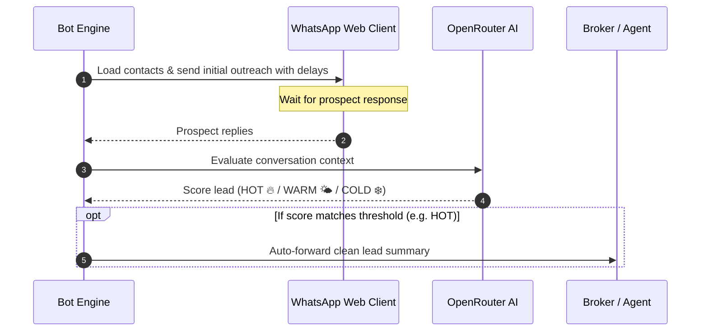

# WhatsApp Real Estate Automation Bot


An intelligent, automated outreach tool tailored for Real Estate professionals. This bot manages initial communications, analyzes responses using AI, and automatically hands off qualified leads to your agents.

## 📊 How It Works



## 🚀 Key Features

- **Automated Drop Loading**: Easily import prospects from a simple `contacts.csv` file.
- **Smart Delay Scheduling**: Mimics human behavior by adding randomized delays between messages to minimize spam detection.
- **AI-Powered Lead Scoring**: Automatically reads prospect replies and grades the lead's temperature using OpenRouter's LLMs.
- **Smart Forwarding to Agents**: Curates the conversation and automatically forwards only the high-intent (HOT) prospects to your personal/team WhatsApp number.
- **Persistent State Tracking**: Resumes safely automatically. Your outreach state is continuously saved in `state.json`.

## 🛠️ Setup & Installation

### Prerequisites
- Node.js v18+
- A dedicated WhatsApp account for outreach 

### 1. Clone the Repository
```bash
git clone https://github.com/maybeswayam/Whatsapp-automation-bot.git
cd Whatsapp-automation-bot
```

### 2. Configuration
Copy the environment template:
```bash
cp .env.example .env
```
Edit `.env` to include your OpenRouter API key and your forwarding/agent WhatsApp number.

### 3. Setup Contacts
Edit `contacts.csv` with your leads. (Format typically includes parameters used by your templates like Name, Phone, and Property details).

### 4. Install & Run
```bash
npm install
npm start
```

*On the first run, the terminal will display a QR code. Open WhatsApp on your mobile device -> Linked Devices -> Scan to authenticate.*

## 📂 Project Architecture

The codebase is modular, making it easy to adapt or expand:

- `index.js` - Main entry point configuring modules and running the bot.
- `modules/` 
  - `csvLoader.js` / `stateStore.js` - File parsing and local data management.
  - `templateEngine.js` / `scheduler.js` - Message structuring & queue management with human delays.
  - `waClient.js` / `replyListener.js` - Core WhatsApp web listeners and dispatchers.
  - `aiScorer.js` - LLM interaction for intent grading (via OpenRouter).
  - `forwardEngine.js` - Agent notification routing.

## ⚠️ Compliance & Ban Risk
**Important:** WhatsApp has strict anti-spam policies. Automated cold outreach carries a high risk of the sending number being banned. 
- Warm up your number gradually.
- Keep batch volumes very low.
- Personalize templates heavily to increase positive response rates.
- Understand local regulations regarding cold outreach.
