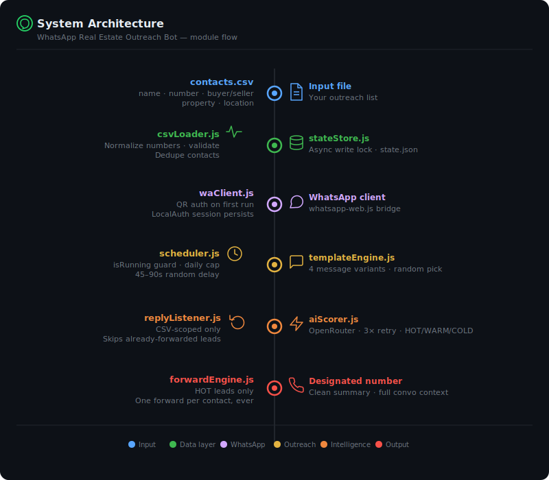
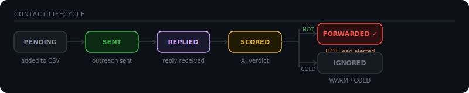

<div align="center">


<br/>

[](https://nodejs.org)
[](https://github.com/pedroslopez/whatsapp-web.js)
[](https://ai.google.dev)
[](LICENSE)

</div>

<br/>

Automated WhatsApp outreach bot built for real estate. Drop in a CSV of leads, walk away — the bot messages everyone with personalized openers, listens for replies, scores each conversation with AI, and instantly forwards hot leads to your phone.

---

## How it works

1. **Sends personalized opening messages** to every contact with human-like random delays between each one
2. **Monitors all inbound replies** and matches them back to your contact list
3. **Scores each conversation** via AI (HOT / WARM / COLD) using the full message context
4. **Forwards a clean summary** to your designated WhatsApp number the moment a HOT lead is detected

---

## System architecture



---

## Contact lifecycle



Each contact is tracked end-to-end. Once a lead is forwarded, subsequent messages are stored but the lead is never double-alerted.

---

## Project structure

```
whatsapp-realestate-bot/
├── index.js                 # Orchestrator — wires everything together
├── config.js                # Central config, reads .env
├── contacts.csv             # Your input contact list
├── .env.example             # Environment variable template
├── assets/                  # README graphics
└── modules/
    ├── csvLoader.js         # Parse, normalize, validate, dedupe contacts
    ├── stateStore.js        # JSON persistence with async write lock
    ├── templateEngine.js    # AI-generated personalized messages
    ├── waClient.js          # whatsapp-web.js + LocalAuth session
    ├── scheduler.js         # Outreach pacing, concurrency guard, daily cap
    ├── replyListener.js     # Inbound handler, scoped to CSV contacts only
    ├── aiScorer.js          # Gemini scoring with exponential retry
    └── forwardEngine.js     # Format and forward HOT leads, one-time only
```

---

## Quick start

### 1. Clone and install

```bash
git clone https://github.com/maybeswayam/Whatsapp-automation-bot.git
cd Whatsapp-automation-bot
npm install
```

### 2. Configure environment

```bash
cp .env.example .env
```

Open `.env` and set:

```env
# Required
GEMINI_API_KEY=your_gemini_api_key_here
FORWARD_TO_NUMBER=918979909409        # digits only — no + or spaces

# Optional tuning
GEMINI_MODEL=gemini-3.5-flash         # Gemini model to use
MIN_DELAY_SECONDS=45
MAX_DELAY_SECONDS=90
MAX_MESSAGES_PER_DAY=35
FORWARD_IF_SCORE_IN=HOT

# Optional: Use OpenRouter instead of Gemini
# AI_PROVIDER=openrouter
# OPENROUTER_API_KEY=your_key_here
# OPENROUTER_MODEL=meta-llama/llama-3.1-8b-instruct:free
```

### 3. Prepare your contact list

Edit `contacts.csv`:

```csv
name,number,intent,property_type,location
Rahul Sharma,+91 98765 43210,buyer,2BHK,Noida
Priya Singh,919876543211,seller,villa,Gurgaon
Amit Verma,+91-9123456789,buyer,,Delhi
```

| Column | Required | Notes |
|---|---|---|
| `name` | ✅ | Used in the opening message |
| `number` | ✅ | Any format — normalized automatically |
| `intent` | ✅ | `buyer` or `seller` |
| `property_type` | ✗ | e.g. `2BHK`, `villa`, `plot` |
| `location` | ✗ | e.g. `Noida`, `Gurgaon` |

### 4. Run

```bash
npm start
```

On first run, scan the QR code printed in terminal using **WhatsApp → Linked Devices → Link a device**. Session is saved — no QR needed after that.

---

## AI lead scoring

Every inbound reply triggers a Gemini API call with the full conversation thread as context. The model returns a structured verdict:

```json
{
  "score": "HOT",
  "reason": "Prospect asked about price range and requested a site visit"
}
```

- **HOT** — forwarded immediately with a full conversation summary
- **WARM** — logged in state, no forward
- **COLD** — logged in state, no forward

The scorer retries up to 3 times with exponential backoff on API failures. Once a lead is forwarded, scoring is skipped on all future replies from that contact — preserving API credits.

---

## What a forwarded message looks like

```
🔥 HOT LEAD ALERT

👤 Name: Rahul Sharma
📞 Number: +919876543210
🏠 Intent: Buyer | 2BHK | Noida

💬 Conversation:
  You → "Hi Rahul, I came across your inquiry about buying a 2BHK in Noida..."
  Rahul → "Yes interested, what's the price range?"
  You → "Options between ₹45L–₹65L depending on floor"
  Rahul → "Can I visit this Saturday?"

🤖 AI Verdict: HOT
📝 Reason: Asked about price and requested a site visit

⏱ Time: 20 May 2026, 4:32 PM
```

---

## Safety and anti-ban controls

| Control | Setting | Why |
|---|---|---|
| Message delay | 45–90s randomized | Mimics natural human pacing |
| Daily cap | 35 messages/day | Stays below detection threshold |
| Concurrency guard | `isRunning` flag | Prevents duplicate sends on interval overlap |
| Contact scoping | CSV contacts only | Ignores all messages from unknown numbers |
| Session persistence | `LocalAuth` strategy | No repeated QR scans after first login |
| Template variants | 4 distinct messages per intent | Avoids identical-message spam detection |

> **Recommended:** Use a dedicated SIM/number for the bot rather than your personal number.

---

## Configuration reference

| Variable | Default | Description |
|---|---|---|
| `GEMINI_API_KEY` | — | **Required.** Your Google Gemini API key ([Get one here](https://ai.google.dev)) |
| `FORWARD_TO_NUMBER` | — | **Required.** Digits-only number to receive alerts |
| `GEMINI_MODEL` | `gemini-3.5-flash` | Gemini model for scoring and message generation |
| `MIN_DELAY_SECONDS` | `45` | Minimum gap between outreach messages |
| `MAX_DELAY_SECONDS` | `90` | Maximum gap between outreach messages |
| `MAX_MESSAGES_PER_DAY` | `35` | Daily outreach cap, resets at midnight |
| `FORWARD_IF_SCORE_IN` | `HOT` | Scores that trigger forwarding |
| `AI_PROVIDER` | `gemini` | AI provider to use (`gemini` or `openrouter`) |

### Legacy OpenRouter Support

| Variable | Default | Description |
|---|---|---|
| `OPENROUTER_API_KEY` | — | Your OpenRouter API key (when using OpenRouter) |
| `OPENROUTER_MODEL` | `openrouter/free` | Model for lead scoring (when using OpenRouter) |

---

## Tech stack

- **[whatsapp-web.js](https://github.com/pedroslopez/whatsapp-web.js)** — WhatsApp Web automation via Puppeteer
- **[Google Gemini](https://ai.google.dev)** — Gemini 3.5 Flash for AI-powered message generation and lead scoring (OpenRouter also supported)
- **Node.js ESM** — Native ES modules throughout
- **JSON state** — Flat file persistence with async mutex for safe concurrent writes

---

## Roadmap

- [ ] Opt-out detection — flag contacts who reply with STOP / not interested
- [ ] Per-contact backoff when a lead replies negatively
- [ ] SQLite migration for larger contact lists (100+)
- [ ] Dry-run mode — preview messages without sending
- [ ] Simple web dashboard to view contact status and conversation history

---

<div align="center">
  <sub>Built for real estate outreach automation &nbsp;·&nbsp; Use responsibly</sub>
</div>
